# The Backrooms Map Generator

Generates top-down maps that look like Level 0 of the Backrooms: endless
overlapping corridors, arbitrarily placed rooms, pillar halls, and odd
polygonal chambers. Built with Python and pygame.

> If you're not careful and you noclip out of reality in the wrong areas
> you'll end up in the Backrooms, where it's nothing but the stink of old
> moist carpet, the madness of mono-yellow, the endless background noise of
> fluorescent lights at maximum hum-buzz, and approximately six hundred
> million square miles of randomly segmented empty rooms to be trapped in.
> God save you if you hear something wandering around nearby, because it
> sure as hell has heard you.

Sources: [Backrooms Wiki — Level 0](https://backrooms.fandom.com/wiki/Level_0),
[Wikipedia — The Backrooms](https://en.wikipedia.org/wiki/The_Backrooms)

## GL walkthrough (new — this is the one)

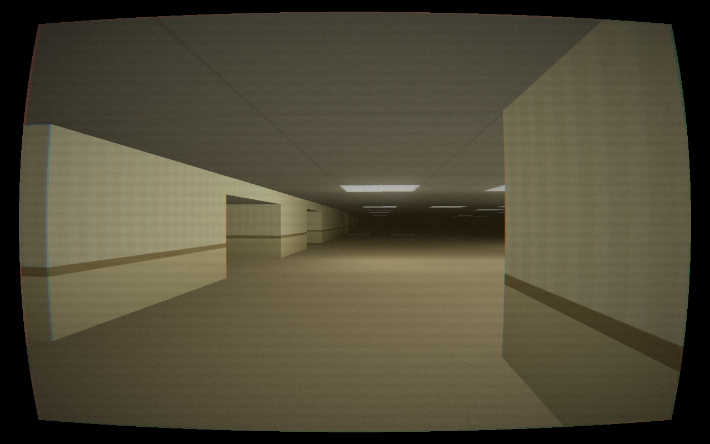

`backrooms_gl.py` renders the same simulation on the GPU with ModernGL:

```bash
pip install moderngl
python backrooms_gl.py            # fullscreen found footage
python backrooms_gl.py --manual   # you hold the camera
```

- **real lighting**: every live fluorescent panel is a point light; light
  pools under fixtures and dies off into the dark. Blackouts, dying
  lights, and the Presence's darkness trail all reach the shader.
- **real geometry**: slopes, stairs, lintels, pillars as actual triangles
- **a camcorder lens**, because the wanderer is *filming* this: he
  auto-zooms down dark corridors to check them (zoom genuinely extends
  how far he can see), telephoto shake, focus breathing, auto-exposure
  that overshoots between dark and light, barrel distortion, chromatic
  aberration, grain, scanlines
- bloom that makes fluorescents glow like fluorescents; the Howler as a
  lit billboard with its baked walk cycle


The pygame renderer below still works everywhere (no GPU needed) and
remains what the packaged app uses for now.

## 3D walkthrough

`backrooms_walk.py` renders the generated maps first-person with a software
raycaster and walks itself through Level 0:

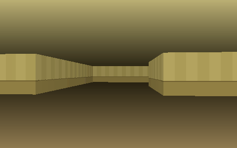

```bash
python backrooms_walk.py                 # auto-walk demo (it drives)
python backrooms_walk.py --manual        # you drive (WASD + arrows)
python backrooms_walk.py --record demo.gif --seconds 8   # headless GIF (needs pillow)
```

Every cell has its own floor and ceiling height (a Build-engine-style
stepped sector renderer), so the level does what the canon says it does.
Scale: 1 unit = one normal room height (~9 ft).

| | |
| --- | --- |
| 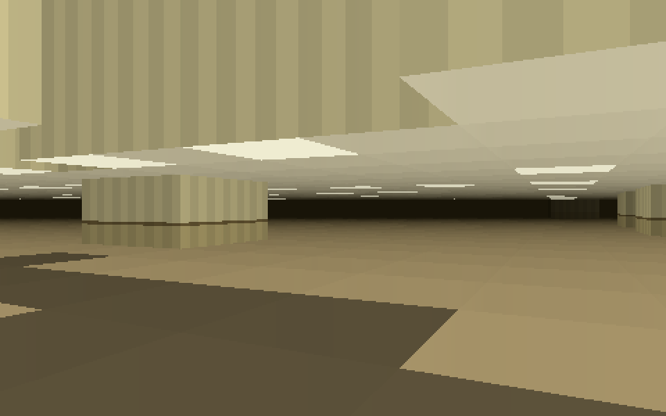 | **Grand halls** — pillared chambers with ceilings up to ~30 ft. The deeper canon: rooms get "so massive that it's impossible to see the edge, or the lights get too high to reach the ground" — so floors dim under very tall ceilings. |
| 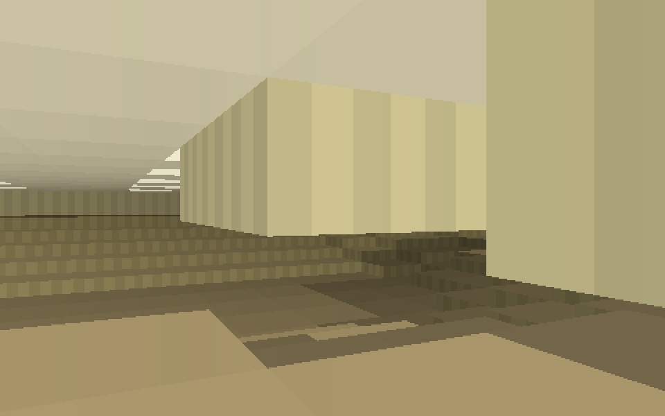 | **Sunken wings & stairs** — the floor terraces down ring by ring into lower areas; steps auto-climb like stair risers. |
| 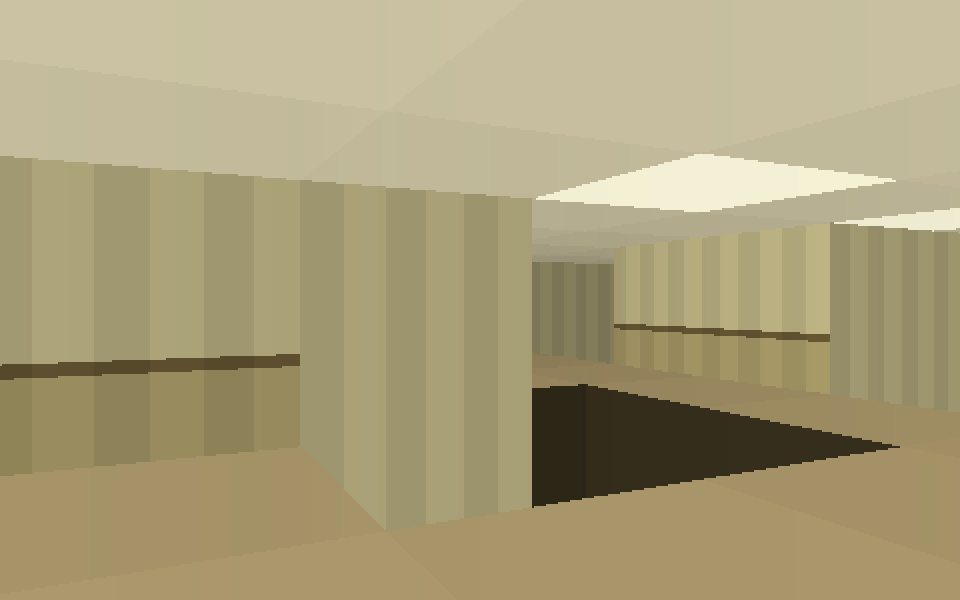 | **The Pitfalls** — lattice-pattern fields of carpeted shafts ~8 m deep. Fall in and you noclip deeper: fade out, respawn somewhere else in the level. |

| 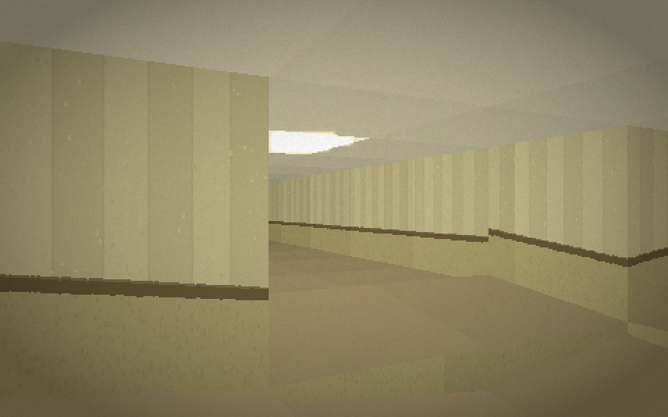 | **Ramps & raked floors** — real sloped floors: smooth ramps down into sunken wings, and Kane Pixels-style "raked" areas where the whole floor leans a few degrees in one direction. Barely enough to notice; exactly enough to be wrong. |
| 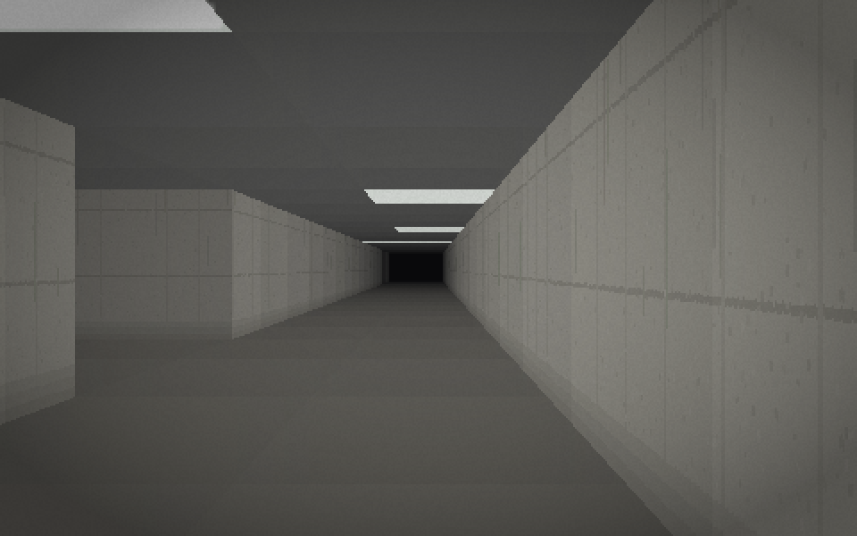 | **Level 1** (`--level 1`) — the endless parking structure: formwork-lined concrete, pillar forests, rows of strip lighting, garage ramps everywhere, a deeper 60 Hz hum, and water dripping somewhere out of sight. |

### The wanderer is alive now

Movement is driven by effort and fear, not a constant speed:

- **terrain matters** — uphill and stair-climbs are slower, downhill is a
  touch faster, and sustained running builds exhaustion that drags the pace
- **crouching is deliberate** — the walker sees a crawlspace coming on its
  route and starts folding down *before* the doorway, over a good second;
  standing back up is slower still. Unless he's running. Then he ducks fast,
  because he has to.
- **breathing and a quiet heartbeat**, always present, barely audible when
  calm — rate and volume follow fear and exertion
- **fear spikes fast and decays slow**, quickening his step before it ever
  becomes a run

### The Presence

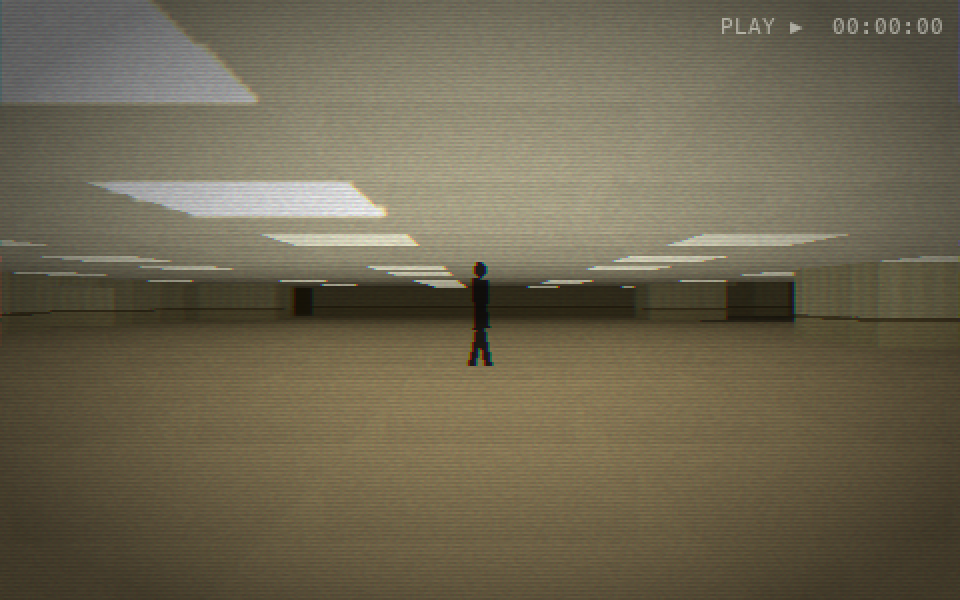

It's the Howler now: directional sprites baked in Blender from a rigged
community model of Kane Pixels' bacteria (8 walk phases × 8 view angles,
posed procedurally — see [CREDITS.md](CREDITS.md)), with a contact
shadow, depth occlusion, and fog fade. If the sprite sheet is missing it
falls back to a procedural silhouette.

Something is always somewhere in the level, and it is always *walking*
toward you. It never runs. You hear its footsteps before you see it —
real positional audio, louder and panned as it closes. The lights get
nervous when it's near. Catch line of sight and there's a dark figure at
the end of the corridor.

It runs a real state machine:

- **STALK** — unseen, it rubber-bands: the farther away, the faster it
  covers ground. It is always closing.
- **LURK** — catch it in your sights at range and it *stops and stands
  there*. Stare too long and it starts walking anyway.
- **HUNT** — inside eight cells it commits, and it **screams** once — a
  distorted descending shriek. Breaking line of sight long enough drops
  it back to stalking. A continuous low growl gives away how close it is.

It **kills the lights around itself** as it moves, approaching inside its
own pocket of darkness — and seeing it requires light where it stands, so
you look back down the corridor and see nothing at all. The lights
recover after it passes. That's how you know it was there.

Fear is **perception, not radar**: the wanderer only fears what he can
see (line of sight, in his field of view, enough light) or hear.
Footsteps behind him make him stop, turn, and *look* — and mid-chase he
throws glances over his shoulder every few seconds without breaking
stride. Confirmation is what breaks him into a run.

Chases are dangerous now: running builds exhaustion that cuts his top
speed nearly in half, while the hunt never tires. Fresh, you outrun it;
winded, you escape only by breaking its line of sight.

It never teleports. If the Peripheral Shift walls it off, it waits —
only after a long time sealed away does it turn up somewhere else. It
always finds another way.

Past the fear threshold the wanderer panics and **runs**, planning
escape routes away from it (manual mode: hold `SHIFT` to run). You can
outrun it. You cannot make it stop. If it ever reaches you: lights out —
and you're somewhere else in the level, heart pounding. Nothing is ever
confirmed on Level 0.

`--no-entity` turns it off for a peaceful screensaver.

### Found-footage finish

A numpy post-processing pass (skip with `--no-fx`; degrades gracefully if
numpy is missing): the fluorescent panels **bloom**, a soft **vignette**
tightens and darkens as fear rises, and **film grain** sits over
everything, heavier when he's scared. A slight head sway rides on the
stride. `--hires` renders at 640x400 instead of 480x300.

On top of that, a **VHS layer** (`--no-vhs` to drop it): scanlines,
chroma bleed, a timecode in the corner, and tracking errors that tear
across the frame — more often when he's terrified.

### Sound (all synthesized, stereo)

- fluorescent **ballast buzz** — harmonic stack + filtered noise, 120 Hz on
  Level 0, 60 Hz on Level 1 (`--mute` to silence). The hum is **proximity
  based**: loud under a live panel, faint in blackout zones, dipping when
  the lights flicker.
- **dying lights are rare and uncertain** — a bank starts sputtering in
  irregular stutters and holds, and usually steadies itself. Sometimes it
  doesn't: electrical crackle and a thin whine ringing down, no Hollywood
  thud. You'll find yourself wondering every time.
- **distant danger** — knocks, drags, low room-tone swells, all panned to
  where it actually is; the closer it gets, the more frantic the
  soundscape becomes
- **its footsteps**, positional and panned — approaching or receding for
  real. God save you if you hear something wandering around nearby,
  because it sure as hell has heard you.
- **breathing and heartbeat** that track fear and exertion
- **dying lights**: now and then a bank of lights ahead strobes, clunks,
  and dies — the area stays dark for a while, then slowly hums back to life
- water **drips** in the garage

Plus, from the same canon research:

- **crawlspaces** ~4 ft tall — you auto-crouch and slow down
  (like the space above the drop ceiling, but you're in it)
- **drop-ceiling fluorescent panels**, inconsistently placed, with flicker;
  whole **blackout zones** have no lights at all
- **textured wallpaper** — procedurally generated striped paper with a dark
  chair-rail trim, matched to the original Level 0 photo; Berber carpet,
  synthesized 120 Hz hum-buzz (`--mute`)
- an auto-walker that **plans real routes**: BFS pathfinding to distant
  goals along a drifting exploration heading, smooth carrot-point steering,
  velocity easing, and a stride-synced camera bob
- **Peripheral Shift** — the map quietly re-carves itself in areas you are
  not looking at, so retracing your steps never quite works. Watch it happen
  on the minimap (`M`). Disable with `--no-shift`.
- **doorways** — door-height lintels punched into wall gaps, so the
  segmented rooms read as rooms instead of missing wall
- dead ends everywhere, and the world wraps at the edges — it goes on
  seemingly forever
- no entities. Level 0 is empty. That's the point.

Useful flags: `--spawn-zone tall|crawl|pit|stairs|ramp` spawns you next to
a specific zone; `--frame out.png` renders a single frame headlessly;
`--export map.json` dumps the whole world (per-cell floor/ceiling heights,
slopes, lighting, panels) as JSON for use in other engines.

Starts fullscreen (`--windowed` for a window). The guide overlay shows
briefly at launch and after any keypress, then fades out.

| Key | Action |
| --- | --- |
| `TAB` | Toggle auto-walk / manual |
| `W A S D` | Move / strafe (manual) |
| `SHIFT` | Run (manual) |
| Arrows / `Q` `E` | Turn |
| `M` | Toggle minimap |
| `R` | New map (new seed) |
| `F` | Toggle fullscreen |
| `F12` | Screenshot |
| `Esc` | Quit |

## Examples

Mono-yellow theme (`--seed 1234`):

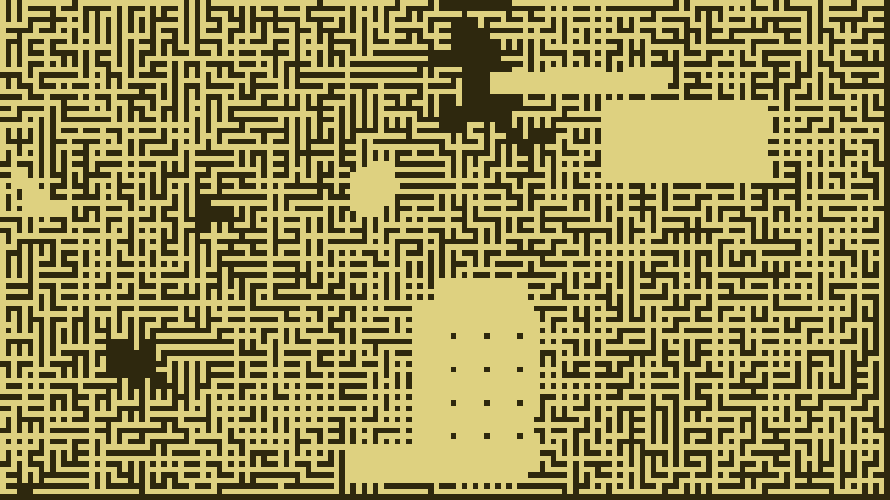

Classic black & white (`--theme mono --seed 42`):

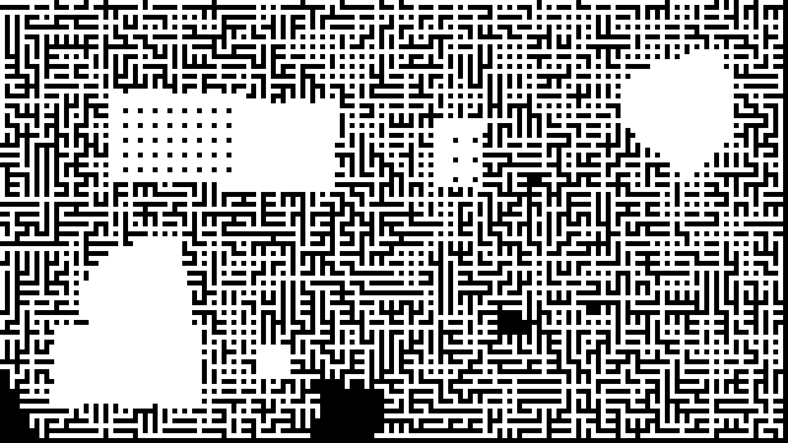

Blueprint (`--theme blueprint --seed 7 --fill 0.6`):

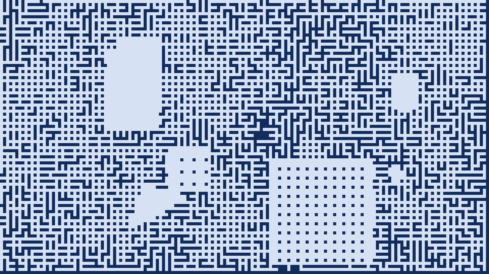

## Install & run

```bash
pip install -r requirements.txt
python backrooms_generator.py
```

Render straight to a PNG without opening a window:

```bash
python backrooms_generator.py --save map.png --seed 1234
```

Maps are fully deterministic per seed — share a seed and anyone can
regenerate the exact same map.

## Controls

| Key | Action |
| --- | --- |
| `R` | Regenerate with a new seed |
| `S` | Save the current map as `backrooms_<seed>.png` |
| `C` | Cycle color themes (backrooms / mono / blueprint) |
| `F` | Toggle fullscreen |
| `Q` / `Esc` | Quit |

The window title shows the current seed and theme.

## Options

```
--width N         window width in pixels (default 1280)
--height N        window height in pixels (default 720)
--cell N          cell size in pixels (default 8) — bigger = chunkier maps
--fill F          target floor fraction 0-1 (default 0.55) — higher = more open
--rooms N         rectangular rooms (default 3)
--pillar-rooms N  halls with pillar grids (default 2)
--poly-rooms N    irregular polygonal rooms (default 2)
--theme NAME      backrooms | mono | blueprint
--seed N          seed for reproducible maps
--save PATH       render to a PNG and exit
--fullscreen      start fullscreen
```

Finer knobs (layer budgets, merge probability, room size ranges, pillar
spacing) live in the `Config` dataclass at the top of
[backrooms_generator.py](backrooms_generator.py).

## How it works

1. **Corridors** — hundreds of small, partial mazes are carved with a
   growing-tree algorithm. Each starts at a random spot and runs out of
   budget before it can become an orderly labyrinth; where layers collide
   they randomly merge or stop dead. Overlaying them produces the
   trademark "randomly segmented" floor plan.
2. **Rooms** — rectangular rooms, irregular polygonal chambers, and pillar
   halls are stamped on top.
3. **Cleanup** — orphan floor specks stranded in solid wall are removed.
   Lone wall cells in open floor are deliberately kept: they read as
   pillars.

## Standalone app

```bash
./build_app.sh        # macOS: dist/The Backrooms.app (works on Win/Linux too)
```

Bundles everything with PyInstaller, using an icon rendered by the engine
itself ([assets/icon.png](assets/icon.png) — that's a real generated frame).

## Ideas / contributions welcome

- More levels (the Poolrooms, Level ! run corridor, Level 37)
- Floor/ceiling texturing (currently flat-shaded planes)
- Multiplayer isolation: two wanderers in the same map who can hear but
  never find each other (the canon Isolation Effect)

## History

The original version of this project was written with ChatGPT in 2023.
It was rewritten from scratch in 2026 with Claude: seeded/reproducible
generation, a cleaner layered-maze algorithm, color themes, PNG export,
a headless CLI mode, and an actual frame limiter.
